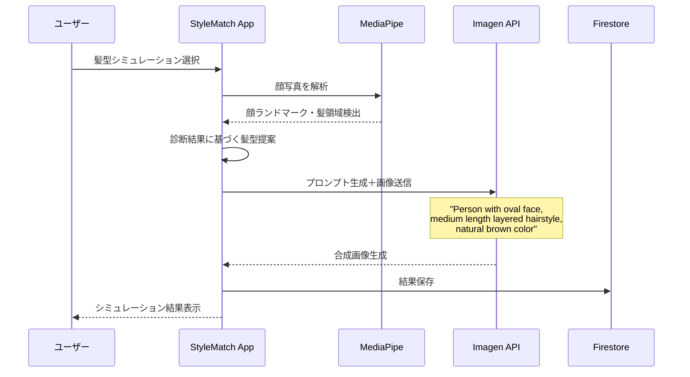

# 💇 AI髪型シミュレーション機能 実装提案

## 📋 概要

「あなたに合う美容師を探す」機能を、**AI髪型シミュレーション**機能に置き換える提案です。

## 🚀 実装方法

### 方法1: MediaPipe + Imagen API（推奨）



### 方法2: StyleGAN2 + MediaPipe（高度な実装）

より高品質な結果が期待できますが、実装難易度が高くなります。

## 💰 コスト試算

### Imagen API使用時
- **開発・テスト段階**: 月100枚 = $4（約600円）
- **100ユーザー**: 月200枚 = $8（約1,200円）
- **1,000ユーザー**: 月2,000枚 = $80（約12,000円）

## 🛠️ 実装ステップ

### Step 1: UI変更（即実装可能）

```typescript
// src/app/diagnosis/result/page.tsx の修正
<Button 
  onClick={() => router.push('/hairstyle-simulation')}
  className="w-full"
>
  AIで似合う髪型をシミュレーション
</Button>
```

### Step 2: MediaPipe統合

```typescript
// src/lib/services/face-detection.service.ts
import { FaceLandmarker, FilesetResolver } from '@mediapipe/tasks-vision';

export class FaceDetectionService {
  private faceLandmarker: FaceLandmarker;

  async initialize() {
    const vision = await FilesetResolver.forVisionTasks(
      "https://cdn.jsdelivr.net/npm/@mediapipe/tasks-vision@latest/wasm"
    );
    
    this.faceLandmarker = await FaceLandmarker.createFromOptions(vision, {
      baseOptions: {
        modelAssetPath: 'face_landmarker.task',
      },
      runningMode: "IMAGE",
      numFaces: 1,
    });
  }

  async detectFaceLandmarks(imageElement: HTMLImageElement) {
    const results = this.faceLandmarker.detect(imageElement);
    return {
      landmarks: results.faceLandmarks,
      blendshapes: results.faceBlendshapes,
      hairSegmentation: await this.segmentHair(imageElement)
    };
  }
}
```

### Step 3: Imagen API統合

```typescript
// src/lib/services/hairstyle-generator.service.ts
export class HairstyleGeneratorService {
  private readonly IMAGEN_API_URL = 'https://generativelanguage.googleapis.com/v1beta/models/imagen-4:generateImage';

  async generateHairstyle(
    userImage: string,
    faceType: string,
    stylePreference: string
  ) {
    const prompt = this.buildPrompt(faceType, stylePreference);
    
    const response = await fetch(this.IMAGEN_API_URL, {
      method: 'POST',
      headers: {
        'Content-Type': 'application/json',
        'Authorization': `Bearer ${process.env.GOOGLE_AI_API_KEY}`
      },
      body: JSON.stringify({
        prompt,
        image: {
          bytesBase64Encoded: userImage
        },
        sampleCount: 4, // 4つのバリエーション生成
        aspectRatio: "1:1",
        personGeneration: "allow_adult",
        safetyFilterLevel: "block_some",
        includeSafetyAttributes: true
      })
    });

    return response.json();
  }

  private buildPrompt(faceType: string, style: string): string {
    const prompts: Record<string, string> = {
      '卵型': 'elegant layered hairstyle that enhances oval face shape',
      '丸型': 'volumized hairstyle with height to elongate round face',
      '面長': 'side-swept bangs and wavy hair to balance long face',
      '四角型': 'soft waves and layers to soften square jawline',
      '逆三角形': 'chin-length bob with volume at bottom for heart-shaped face',
      'ベース型': 'textured layers to balance strong jawline'
    };

    return `Professional hairstyle simulation: ${prompts[faceType]}, ${style} style, natural looking, salon quality`;
  }
}
```

### Step 4: シミュレーション画面

```typescript
// src/app/hairstyle-simulation/page.tsx
export default function HairstyleSimulation() {
  const [simulations, setSimulations] = useState<string[]>([]);
  const [loading, setLoading] = useState(false);

  const handleSimulation = async () => {
    setLoading(true);
    try {
      const results = await hairstyleService.generateHairstyle(
        userImage,
        diagnosisResult.faceType,
        selectedStyle
      );
      setSimulations(results.images);
    } finally {
      setLoading(false);
    }
  };

  return (
    <div className="container mx-auto p-4">
      <h1 className="text-2xl font-bold mb-4">
        AIヘアスタイルシミュレーション
      </h1>
      
      <div className="grid grid-cols-2 gap-4">
        {/* オリジナル画像 */}
        <div>
          <h3>現在のスタイル</h3>
          
        </div>
        
        {/* シミュレーション結果 */}
        <div className="grid grid-cols-2 gap-2">
          {simulations.map((img, idx) => (
            <div key={idx}>
              <h3>提案スタイル{idx + 1}</h3>
              
            </div>
          ))}
        </div>
      </div>
    </div>
  );
}
```

## 🎯 実装の利点

1. **即座に価値提供**: 美容師登録を待たずにユーザーに価値を提供
2. **バイラル性**: SNSでシェアしたくなる機能
3. **収益化**: プレミアム機能として課金も可能
4. **差別化**: 他の美容アプリにない独自機能

## ⚠️ 注意事項

1. **プライバシー**: 生成画像の取り扱いに注意
2. **期待値管理**: 「参考イメージ」であることを明記
3. **API制限**: レート制限に注意（1分あたり60リクエスト）

## 📅 実装タイムライン

- **Phase 1（1週間）**: UI変更とモックアップ
- **Phase 2（2週間）**: MediaPipe統合
- **Phase 3（1週間）**: Imagen API統合
- **Phase 4（1週間）**: テストと最適化

この機能により、美容師マッチングの前段階として、ユーザーが理想の髪型を見つける手助けができます。