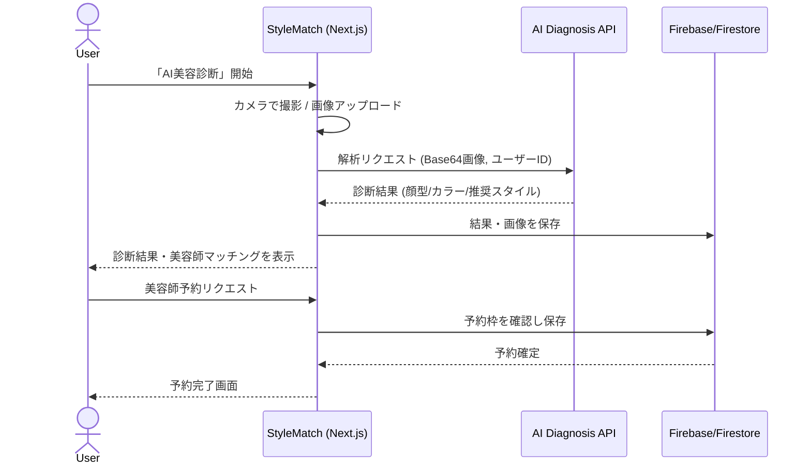

# StyleMatch Premium - AI美容診断マッチングアプリ

AIを活用した顔型診断とパーソナルカラー診断により、ユーザーに最適な美容師をマッチングするWebアプリケーション。

## 🌟 主な機能

- **AI診断機能**
  - 顔型診断（5タイプ分類：卵型、丸顔、四角顔、ハート型、面長）
  - パーソナルカラー診断（4シーズン分類：春夏秋冬）
  - リアルタイムカメラ撮影・画像アップロード対応

- **美容師マッチング**
  - 診断結果に基づく最適な美容師の自動マッチング
  - マッチングスコア表示（0-100%）
  - 位置情報による近隣検索

- **予約システム**
  - カレンダー形式の予約管理
  - リアルタイム空き状況確認
  - 予約履歴管理

## 🛠 技術スタック

### フロントエンド
- **Framework**: Next.js 14 (App Router)
- **Language**: TypeScript
- **Styling**: Tailwind CSS
- **State Management**: Zustand
- **API Client**: Axios + React Query
- **Authentication**: Firebase Auth

### バックエンド
- **AI処理**: Python (Flask)
- **顔認識**: dlib + face_recognition
- **画像処理**: OpenCV + Pillow
- **インフラ**: Firebase (Firestore, Storage, Functions)

## 📊 システムフロー（Mermaid）



## 📦 セットアップ

### 1. リポジトリのクローン

```bash
git clone https://github.com/your-username/stylematch.git
cd stylematch
```

### 2. 依存関係のインストール

#### フロントエンド
```bash
# Node.js 18.x以上が必要です
npm install
```

#### バックエンド（Python）
```bash
cd backend
python -m venv venv
source venv/bin/activate  # Windows: venv\Scripts\activate
pip install -r requirements.txt
```

### 3. 環境変数の設定

`.env.example` を `.env.local` にコピーして、必要な値を設定：

```bash
cp .env.example .env.local
```

必要な環境変数：
- **Firebase設定** (必須)
  - `NEXT_PUBLIC_FIREBASE_API_KEY`
  - `NEXT_PUBLIC_FIREBASE_AUTH_DOMAIN`
  - `NEXT_PUBLIC_FIREBASE_PROJECT_ID`
  - `NEXT_PUBLIC_FIREBASE_STORAGE_BUCKET`
  - `NEXT_PUBLIC_FIREBASE_MESSAGING_SENDER_ID`
  - `NEXT_PUBLIC_FIREBASE_APP_ID`
- **バックエンドURL** (必須)
  - `NEXT_PUBLIC_BACKEND_URL` (デフォルト: http://localhost:8000)
- **その他** (オプション)
  - OpenAI API設定
  - Stripe決済設定
  - メール送信設定

詳細なセットアップ手順は [SETUP.md](./SETUP.md) を参照してください。

### 4. 開発サーバーの起動

#### フロントエンド（ポート3003）
```bash
npm run dev
```

#### バックエンド（ポート8000）
```bash
cd backend
python app.py
```

アプリケーションは http://localhost:3003 でアクセスできます。

### 5. ビルドとプロダクション実行

```bash
# ビルド
npm run build

# プロダクション実行
npm run start
```

## 🏗 プロジェクト構造

```
stylematch-premium/
├── src/
│   ├── app/              # Next.js App Router
│   ├── components/       # Reactコンポーネント
│   ├── lib/             # ユーティリティ・サービス
│   └── types/           # TypeScript型定義
├── backend/
│   ├── models/          # AIモデル
│   ├── services/        # ビジネスロジック
│   └── app.py          # Flask APIエントリーポイント
└── public/             # 静的ファイル
```

## 🔐 セキュリティ

- Firebase Authenticationによる認証
- Firestore Security Rulesによるデータアクセス制御
- 画像は診断後24時間で自動削除
- HTTPS通信の強制

## 📱 対応環境

- **モバイル**: iOS 14+, Android 10+
- **デスクトップ**: Chrome, Safari, Edge（最新版）
- **レスポンシブ対応**: スマートフォン、タブレット、PC

## 🚀 デプロイ

### Vercel（フロントエンド）
```bash
vercel
```

### Cloud Run（バックエンド）
```bash
gcloud run deploy stylematch-ai --source backend/
```

## 📄 ライセンス

This project is licensed under the MIT License.

## 🤝 コントリビューション

プルリクエストは歓迎します。大きな変更の場合は、まずissueを作成して変更内容を議論してください。

## 📞 サポート

- 技術的な質問: [Issues](https://github.com/Shiki0138/stylematch-premium/issues)
- ビジネスに関する問い合わせ: business@stylematch.app
