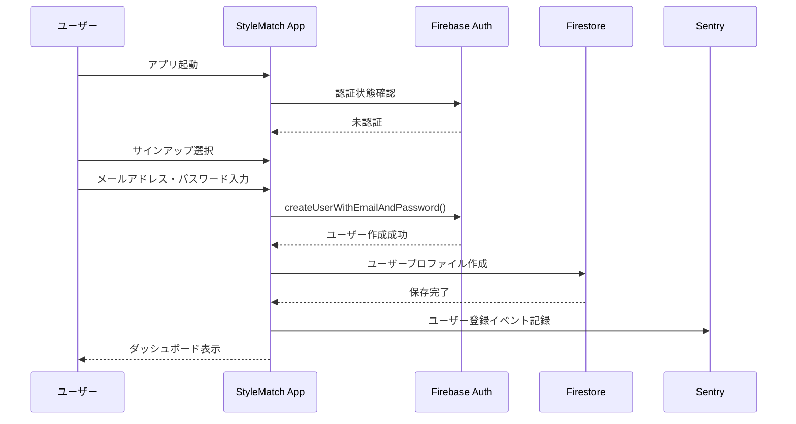
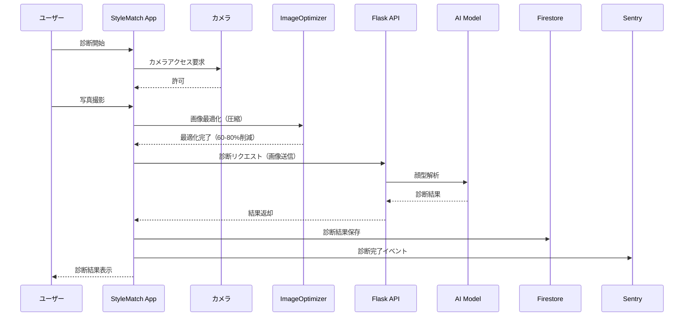
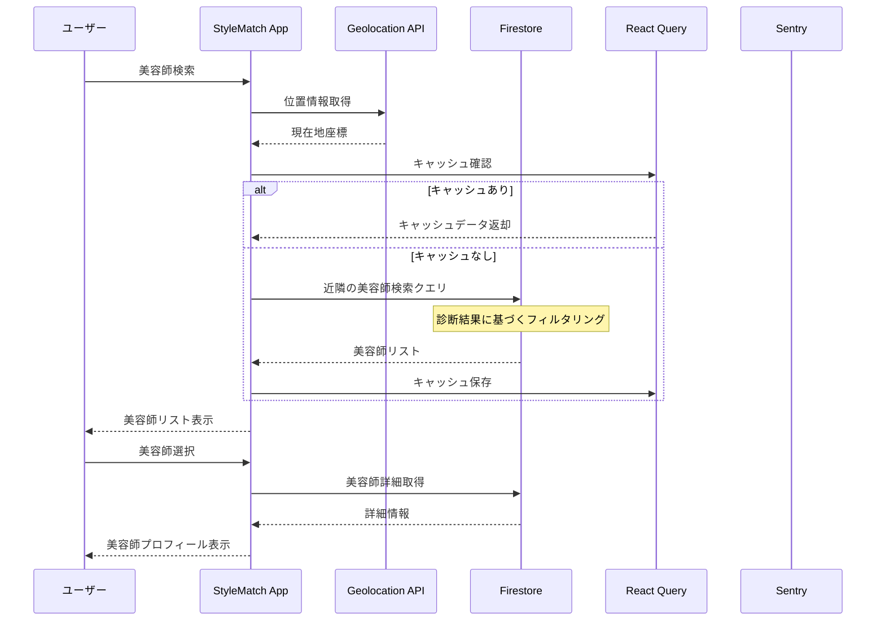
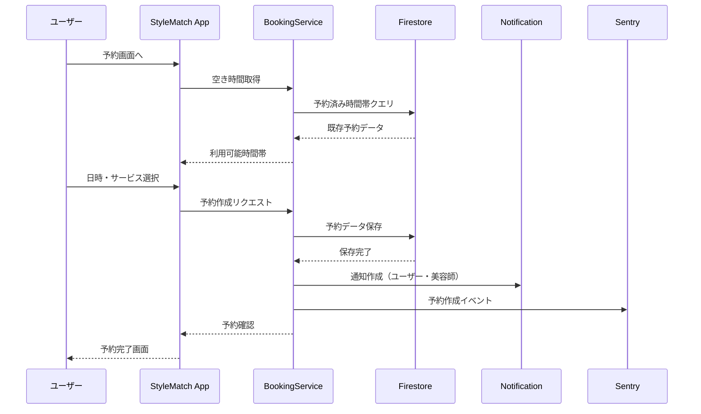
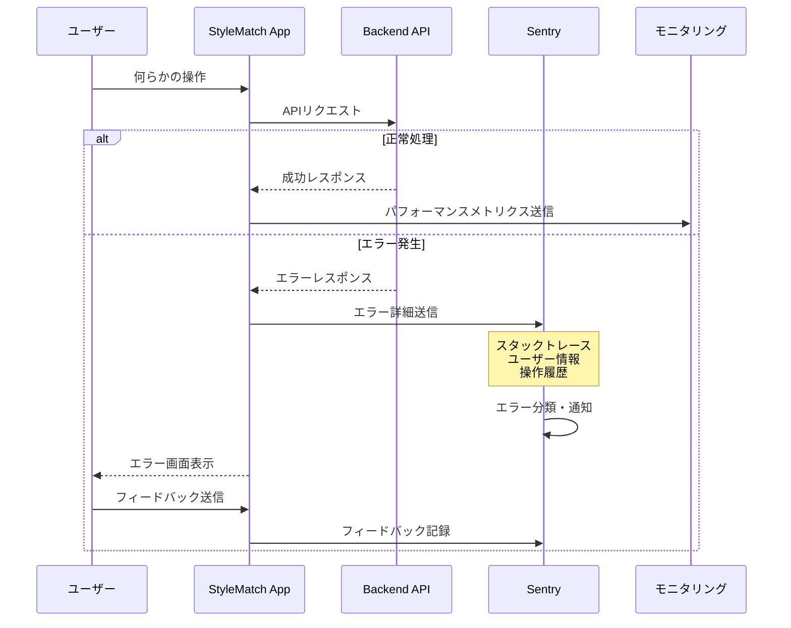
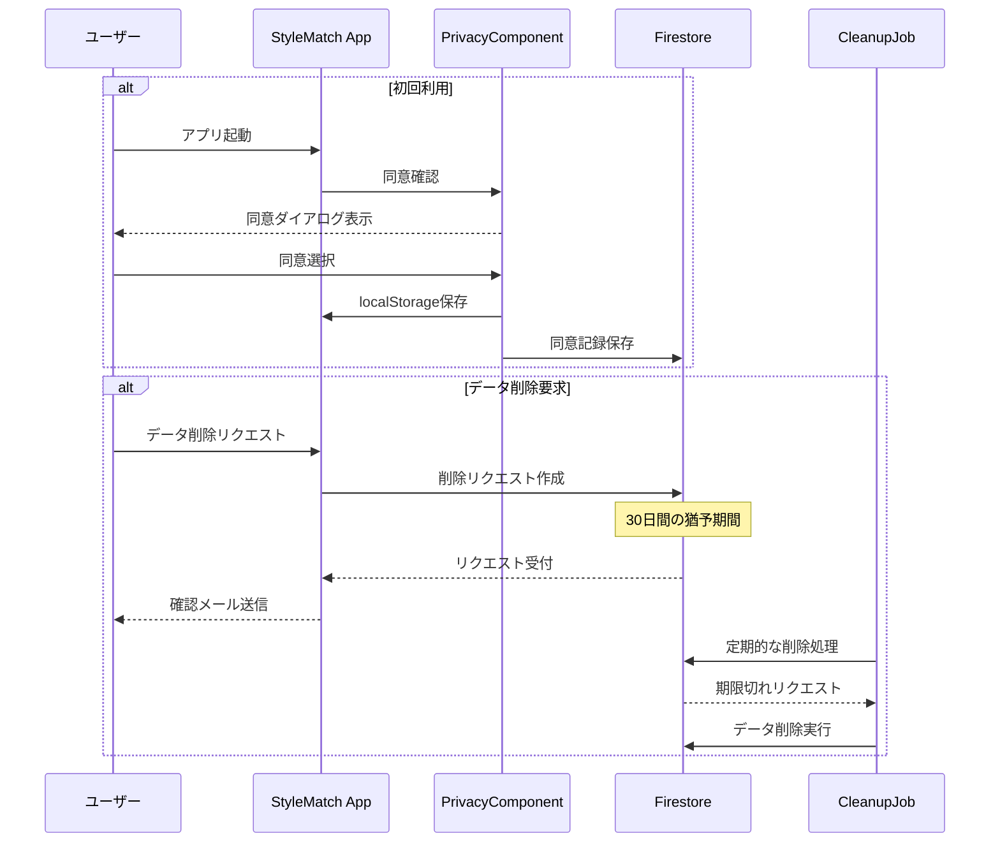
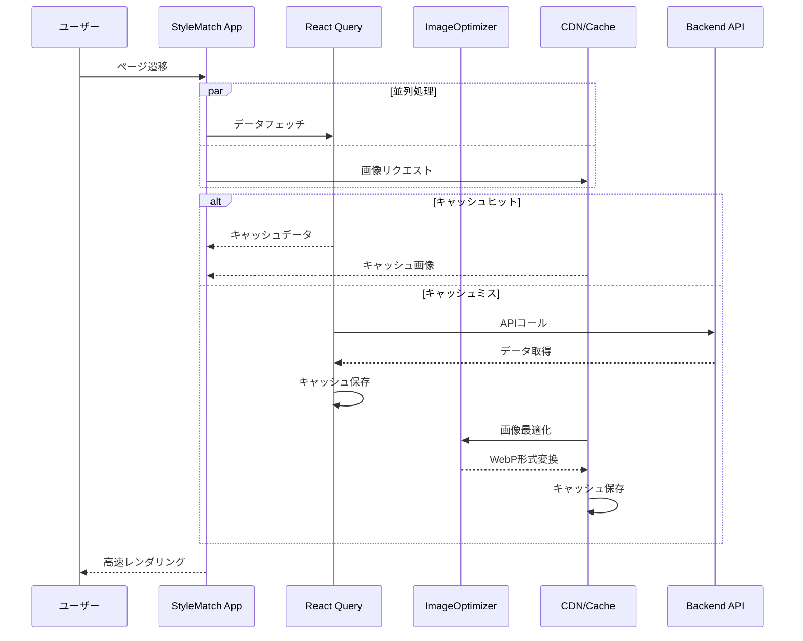
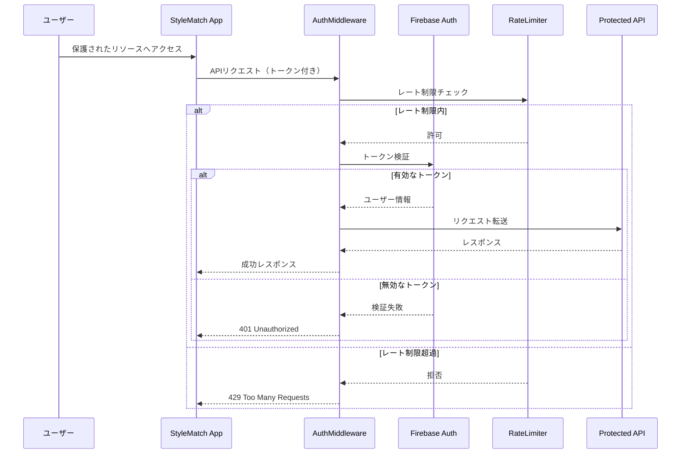

# StyleMatch システムフロー図

## 1. ユーザー登録・認証フロー

## 2. AI顔型診断フロー

## 3. 美容師検索・マッチングフロー

## 4. 予約作成フロー

## 5. エラーハンドリング・モニタリングフロー

## 6. プライバシー・データ管理フロー

## 7. パフォーマンス最適化フロー

## 8. セキュリティ認証フロー

## フロー図の活用方法

これらのフロー図は以下の用途で活用できます：

1. **開発チーム内での仕様共有**
2. **新規メンバーへのシステム説明**
3. **トラブルシューティング時の参照**
4. **パフォーマンスボトルネックの特定**
5. **セキュリティ監査の資料**

各フローは実装済みの機能を正確に反映しており、システムの動作を理解するための重要な資料となります。